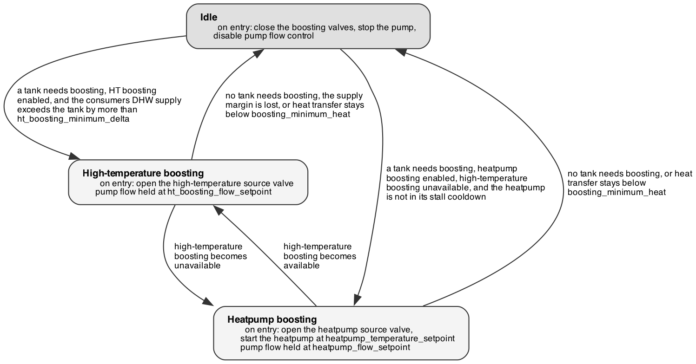

# Domestic hot water (DHW) module — functional description

Supplies hot water to the taps from three buffer tanks, maximising the use of
heat recovered from the drives, DC and high-temperature circuits.

## What it does

Each tank is in exactly one state: **in use**, **filling**, **boosting**,
**needs fill**, **needs boost**, **standby** or **disabled**. The module
reassesses all three once a second, keeping one tank in use, at most one filling
and at most one boosting.

Fresh water entering a filling tank is preheated on the way in: flow-control
valves on the drives recovery and DC circuits modulate to hold their return
lines at `filling_temperature_setpoint`. The drives branch closes when the drives
return no recoverable heat.

Boosting circulates a full tank that has dropped below
`minimum_tank_temperature` through a loop fed by one of two heat sources, at
fixed flow, until it reaches `maximum_tank_temperature`. The pump starts only
once the source valve and a tank supply-and-return pair read open — they take
about 90 seconds to travel — so it never runs against a closed circuit.

When no tank is full and at or above `minimum_tank_temperature`, supply
continues at reduced temperature: the tank in use stays in service while below
temperature, unless a warmer tank is available, in which case the warmest tank
still holding water is selected. A warning is raised in both cases. When neither
heat source is available, boosting remains idle and the tanks cool until a
source returns.

## Modes

The panel reports two modes for this module, independently:

- **Filling** — *idle* or *filling*.
- **Boosting** — *idle*, *high-temperature boosting* or *heatpump boosting*.

## Boosting

{width=78%}

The high-temperature loop is the preferred source and the heatpump the fallback:
heatpump boosting is available only while high-temperature boosting is not, and
the module moves directly between the two without passing through idle.

While boosting, the module compares heat transfer into the tank against
`boosting_minimum_heat`. If it stays below that threshold for longer than
`boosting_stall_window`, after an initial `boosting_startup_grace`, boosting
stops. Stopping from heatpump boosting also disables heatpump boosting for
`boosting_stall_cooldown`, because heat transfer cannot be measured with the
boosting loop closed.

## Tuning

**Sources**

- **`ht_boosting_enabled`, `heatpump_boosting_enabled`** — on, off. Which
  sources may be selected. Enable the heatpump to continue boosting when the
  high-temperature loop is cold; disable a source to exclude it entirely.
- **`ht_boosting_minimum_delta`** — 3 K. How far the consumers' DHW supply must
  exceed the tank temperature before high-temperature boosting starts or
  continues. Raise it if boosting starts on a marginal supply and stops on the
  heat-transfer threshold; lower it to keep using the loop at smaller margins.
- **`ht_boosting_flow_setpoint`** — 10 l/min. Boosting loop flow from the
  high-temperature source, set by the rating of the DHW exchanger.
- **`heatpump_flow_setpoint`** — 25 l/min. Boosting loop flow from the heatpump,
  set by the heatpump's rated flow.
- **`heatpump_temperature_setpoint`** — 65 °C. Supply temperature commanded from
  the heatpump while boosting.

**Tank temperature and level**

- **`minimum_tank_temperature`** — 45 °C. Serves two purposes: a full tank below
  it is boosted, and a tank below it is too cold to be selected for use. Raise it
  for hotter water at the taps and more frequent boosting; lower it to boost less
  often.
- **`maximum_tank_temperature`** — 60 °C. Where boosting stops. Raise it to store
  more heat per tank and boost less often; lower it to reduce standing losses and
  scalding risk. Must stay above `minimum_tank_temperature`.
- **`maximum_tank_level`** — 230 L. Where filling stops; the accepted maximum is
  275 L and the high-level warning is at 265 L.
- **`full_level_lower_band`** — 200 L. The level above which a tank counts as
  full, and so the level at which filling restarts. Widen the gap to
  `maximum_tank_level` to refill less often; narrow it to keep tanks nearer full.
- **`minimum_tank_level`** — 30 L. The level at which a tank in use counts as
  empty and is swapped out. Raise it to swap earlier; lower it to draw more from
  each tank.
- **`filling_temperature_setpoint`** — 40 °C. The return-line temperature the
  drives and DC preheat valves hold while a tank fills. Raise it to recover more
  heat during filling, leaving less for boosting; lower it if the recovery
  circuits are pulled down too far.

**Availability and guards**

- **`tank1_enabled`, `tank2_enabled`, `tank3_enabled`** — all on. Take a tank out
  of service. A disabled tank is released immediately, without waiting for its
  valves to travel.
- **Stall guard** (`boosting_minimum_heat` 1000 W, `boosting_stall_window` 120 s,
  `boosting_startup_grace` 180 s, `boosting_stall_cooldown` 900 s) — the heat
  transfer threshold below which boosting is stopped, how long it must stay
  below, the delay before checking starts, and how long heatpump boosting stays
  disabled afterwards. Lengthen the grace and window if boosting stops during
  normal warm-up.
- **Minimum valve and pump openings** (`minimum_pump_dutypoint` 0.3,
  `drives_flowcontrol_minimum_setpoint` 0.1, `dc_flowcontrol_minimum_setpoint`
  0.1) — floors that guarantee flow through the system, for example so the
  temperature sensors read the circulating medium.
- **Gains for the PID controllers** (`pump_flow_tuning`, `dc_flow_tuning`,
  `drives_flow_tuning`) — proportional, integral and derivative gains, tuned
  during commissioning.

The module rejects a parameter set outright, with nothing applied, if the maximum
tank temperature is below the minimum, if the maximum level is below the minimum,
or if `full_level_lower_band` falls outside the level band. If a change does not
take effect on the panel, check these first.

## Alarms

| Alarm | Severity | Raised when |
|---|---|---|
| Tank *n* high temperature warning / alarm | Warning / Alarm | A tank reads more than 2 K (warning) or 5 K (alarm) above `maximum_tank_temperature`. Boosting should have stopped; check the source valves and the tank sensor. |
| Tank *n* high level warning / alarm | Warning / Alarm | A tank reads above 265 L (warning) or 270 L (alarm). Filling should have stopped; check the inlet valve. |
| Tank in use below minimum temperature | Warning | The tank in use is below `minimum_tank_temperature` and no warmer tank was available to take over. Supply continues at reduced temperature. |

---
*Derived from `src/thrs/control/modules/dhw.py`. Re-issue this manual when the
control logic changes.*
