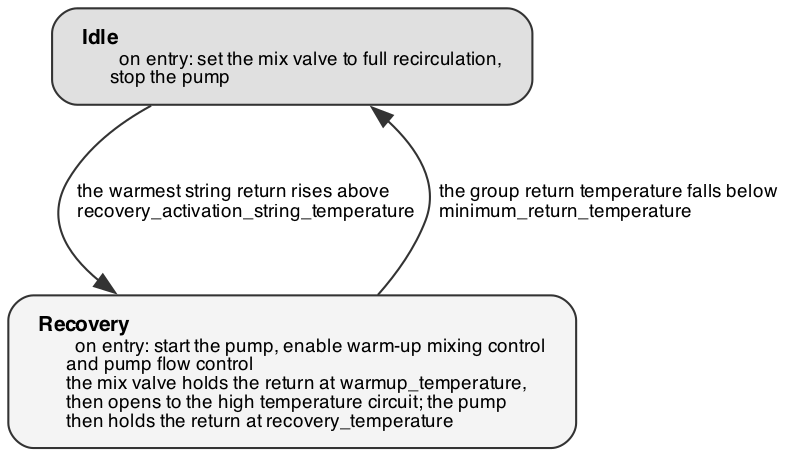

# Photovoltaic-thermal (PVT) module — functional description

Recovers heat from the PVT panel arrays into the high temperature circuit,
maximising solar heat capture while holding the panels and their glycol below
their temperature limit.

## What it does

The panels are arranged in three groups by location — **main forward**, **main
aft** and **owners** — each with its own circulation pump, mix valve and
return-temperature sensor on a shared header. Each group is controlled
independently and can circulate while the others stand idle.

A group starts circulating when the warmest of its string return sensors rises
above `recovery_activation_string_temperature`. Its mix valve first recirculates
panel return back into panel supply, holding the return line at
`warmup_temperature`, so cold glycol is not pushed into the high temperature
circuit; once the loop is up to temperature the valve opens to that circuit and
the pump takes over, modulating flow to hold the return at
`recovery_temperature`. Circulation stops when the return falls below
`minimum_return_temperature`.

Separately and at all times, a mix valve holds the common supply line at
`maximum_supply_temperature` by diverting through the seawater cooler, rejecting
surplus heat overboard. This protects the panels and the glycol from degrading
on a bright day with little demand, and runs regardless of what the groups are
doing.

Each group also has a switch valve that isolates it from the header. The control
opens it at startup and does not operate it again.

## Modes

The panel reports one mode per group, independently:

- **Main forward** — *idle* or *recovery*.
- **Main aft** — *idle* or *recovery*.
- **Owners** — *idle* or *recovery*.

## Operating states

{width=62%}

All three groups run this machine independently.

## Tuning

**Group circulation**

- **`recovery_activation_string_temperature`** — 40 °C. The string return
  temperature above which a group starts circulating. Raise it to stop the pumps
  short-cycling on a cold bright morning; lower it to start harvesting earlier on
  marginal days.
- **`minimum_return_temperature`** — 40 °C. The return temperature below which a
  group stops circulating. Raise it to stop sooner once the panels stop
  delivering; lower it to keep harvesting smaller gains. Must not exceed
  `warmup_temperature`.
- **`warmup_temperature`** — 55 °C. The return temperature the group mix valve
  holds while recirculating, before opening to the high temperature circuit.
  Raise it to keep colder glycol out of that circuit at the cost of a longer
  warm-up; lower it to start delivering heat sooner. Must sit between
  `minimum_return_temperature` and `recovery_temperature`.
- **`recovery_temperature`** — 70 °C. The return temperature the pump holds once
  the group is delivering, by modulating flow. Raise it for a hotter, slower
  circuit; lower it for more flow at a smaller temperature rise. Must stay above
  `warmup_temperature`.
- **`main_fwd_minimum_pump_dutypoint`, `main_aft_minimum_pump_dutypoint`** — 0.3,
  **`owners_minimum_pump_dutypoint`** — 0.4. Floors on pump duty point that
  guarantee roughly 10 l/min through each group, so the return temperature sensor
  reads circulating glycol rather than standing glycol.

**Panel protection**

- **`maximum_supply_temperature`** — 80 °C. The common supply temperature the
  seawater cooler mix valve holds by diverting heat overboard, protecting the
  panels and glycol. The accepted maximum is 90 °C, which is a material limit
  rather than an operating setting.

**Controller gains**

- **Gains for the PID controllers** (`heat_dump_tuning`, `main_fwd_mix_tuning`,
  `main_aft_mix_tuning`, `owners_mix_tuning`, `main_fwd_pump_tuning`,
  `main_aft_pump_tuning`, `owners_pump_tuning`) — proportional, integral and
  derivative gains for the seawater cooler mix valve, and for the mix valve and
  pump of each group. Tuned during commissioning.

The module rejects a parameter set outright, with nothing applied, if
`recovery_temperature` is below `warmup_temperature`, or if `warmup_temperature`
is below `minimum_return_temperature`. If a change does not take effect on the
panel, check these first.

## Alarms

This module raises no alarms. Panel overheating is handled continuously by the
seawater cooler mix valve rather than annunciated.

---
*Derived from `src/thrs/control/modules/pvt.py` and `pvt_group.py`. Re-issue this
manual when the control logic changes.*
