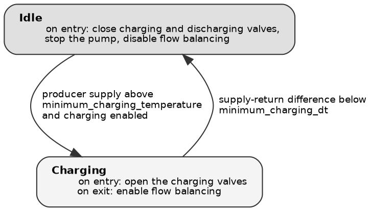

# Manual skeleton and diagram house style

## The manual

Fixed section order, so an engineer who has read one can navigate any of them.
Headings are literal; the italic notes are guidance, not content to reproduce.

```markdown
# <Module> module — functional description

<One sentence: what this module is for. A reader who stops here should still
know whether this is the document they want.>

## What it does

<Three to five sentences. The physical job and what the module is trying to
maximise or protect — say so in the opening line, not halfway down. The
equipment it drives, the loop it runs each second, the measurements it acts on
and the setpoints it holds. Close with what happens when the heat, water or flow
it needs is not available: name the concrete fallback the operator will see.>

## Modes

<The mode is what the panel shows as the current state of the control. Name each
mode dimension the module reports and list its values, one line each:>

- **Filling** — *idle* or *filling*.
- **Boosting** — *idle*, *high-temperature boosting* or *heatpump boosting*.

<Never say a mode is "derived" rather than coming from the state machine; the
operator sees one panel either way.>

## Operating states

{width=55%}

<Caption when it earns one — e.g. "Each of the three PVT groups runs this
machine independently.">

<A table only if it adds something the diagram cannot hold. If the figure
already carries the entry actions and conditions, do not restate them here —
that was the most common redundancy in the first drafts. Omit this whole section
for a module with no state machine; see below.>

## Tuning

<A list, not a three-column table: the explanations are long and a table squeezes
them into an unreadable column. Bold name, default with unit, then the entry —
one clause for equipment-fixed values and guards, a trade-off sentence for real
setpoints.>

- **`minimum_charging_temperature`** — 60 °C. <What it means, then what you gain
  and give up by moving it.>
- **`pcm_charge_flow`** — 5 l/min. <One clause: what fixes this value.>
- **Gains for the PID controllers** (`pump_tuning`, `module1_flow_balance_tuning`,
  …) — proportional, integral and derivative gains, tuned during commissioning.

<Hard constraints from the validators, one line each, in plain words.>

## Alarms

| Alarm | Severity | Raised when |
|---|---|---|
| Tank 1 high temperature warning | Warning | … |

---
*Derived from `src/thrs/control/modules/<module>.py`. Re-issue this manual when
the control logic changes.*
```

Notes:

- **Defaults carry their unit** (`60 °C`, `5 l/min`, `0.3` for a ratio), exactly
  as the step-1 output prints them.
- **Tables are for short cells only.** The alarm table works because every cell
  is a phrase. Tuning entries are sentences, so they go in a list — a long
  sentence in a table cell wraps into a narrow ragged column and reads badly in
  both GitHub and the PDF.
- The PID gains entry goes last, collapsed into one line for all of them.
- **Raised when** is the physical situation, not the predicate. "A tank is
  serving hot water while below its minimum temperature, because no warmer tank
  was available."

## Modules without a state machine

Several modules (PVT at top level, DC, consumers) are continuous control only —
PID loops, no discrete states. Drop the "Operating states" section and replace it
with **"How it regulates"**: one short paragraph or a small table of
*controlled quantity → measurement → setpoint parameter*. Do not invent states to
fill the template, and do not ship a page with an empty section.

| Controlled | From | Held at |
|---|---|---|
| Heat-dump mixing valve | Supply temperature | `maximum_supply_temperature` |

## Diagram house style

Keep every module's figure recognisably the same drawing. Layout left-to-right:
an engineer reads the plant's progression across the page, and it keeps the
figure wide and short, which is what fits above a table.

The generated diagram's structure is the target: each state lists what it *does*
on entry and exit, each edge carries its condition. Translate the method names
into plain engineering; do not drop them.



Rules:

- **State label**: bold name, then the entry and exit actions in smaller type,
  as physical actions — "open the charging valves", not
  `_set_valves_to_charging`. Use an HTML-like label with `<br align="left"/>` so
  the action lines left-align under the name.
- **Edge label**: the real condition, naming the parameter it compares against.
  `\l` at the end of each line left-aligns it. Never a method name or a lambda.
- **Both directions get their own arrow and their own condition.** Merging them
  into one `dir=both` arrow forces a vague label ("… falls away, or returns")
  that tells the reader nothing.
- Shade the idle/resting state so the eye finds the starting point.
- Two conditions on one edge: join with "and" / "or" on separate lines.
- Leave unreachable states out entirely.
- Check the aspect ratio. `rankdir=TB` is the safer default here — entry-action
  labels make nodes wide, and `LR` then pushes the figure past 4:1 and shrinks
  the text to nothing on the page.
